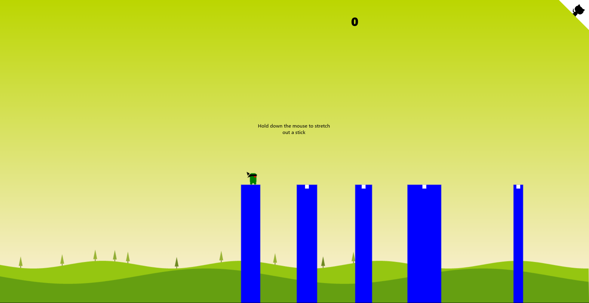

"# Stick-Hero" 
# Stick Hero

Stick Hero is a simple and addictive game where you need to help a stick figure cross gaps by creating bridges with sticks. Test your reflexes and accuracy in this challenging game!

## Demo

You can play the game online at [Game Demo](https://nassim167.github.io/Stick-Hero/).

## How to Play

1. Hold down the mouse button or tap and hold the screen to stretch out a stick.
2. Release the mouse button or lift your finger to drop the stick and create a bridge.
3. Make sure the stick is long enough to reach the other side of the gap.
4. If the stick is too short or too long, the stick figure will fall.
5. The longer the stick, the more points you earn.
6. Try to reach the highest score and beat your own record!

## Technologies Used

- HTML5 Canvas
- CSS3
- JavaScript

## Contributing

Contributions are welcome! If you have any ideas or improvements for the game, feel free to submit a pull request.

## License

This project is licensed under the [MIT License](LICENSE). 

## Acknowledgements

- This game is based on the original Stick Hero game developed by Hunor Marton Borbely. You can find the original codepen at [CodePen](https://codepen.io/HunorMarton/pen/xxOMQKg).
- Special thanks to the developers of the libraries and resources used in this game.

# Stick Hero

Stick Hero is a simple and addictive game where you need to help a stick figure cross gaps by creating bridges with sticks. Test your reflexes and accuracy in this challenging game!

## Demo

You can play the game online at [Game Demo](https://nassim167.github.io/stick-hero/).

## How to Play

1. Hold down the mouse button or tap and hold the screen to stretch out a stick.
2. Release the mouse button or lift your finger to drop the stick and create a bridge.
3. Make sure the stick is long enough to reach the other side of the gap.
4. If the stick is too short or too long, the stick figure will fall.
5. The longer the stick, the more points you earn.
6. Try to reach the highest score and beat your own record!

## Technologies Used

- HTML5 Canvas
- CSS3
- JavaScript

## Contributing

Contributions are welcome! If you have any ideas or improvements for the game, feel free to submit a pull request.

## License

This project is licensed under the [MIT License](LICENSE). 

